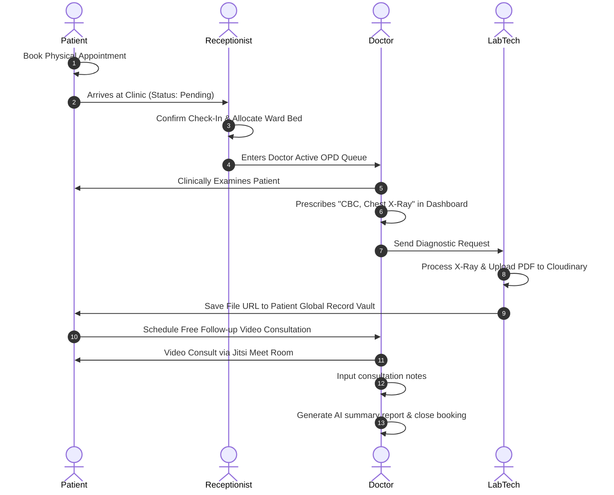

# HealthBridge — Technical Architecture & Implementation Documentation

Welcome to the comprehensive technical documentation for **HealthBridge**. This guide has been compiled to serve as your ultimate reference manual for trainer reviews, architectural walkthroughs, and mock interview preparation.

---

## 1. Product Positioning: The Paradigm Shift
Initially conceived as a basic **Doctor Appointment Booking Platform**, HealthBridge has been restructured into a comprehensive **AI-Powered Healthcare Operating System (OS)**. 

### Why the Shift?
A simple booking engine does not address real-world clinical operations:
* **Organizational Hierarchy:** Hospitals function as corporate networks with multiple branches, departments, and on-boarded clinical employees.
* **Patient Data Ownership:** Medical records, prescription PDFs, and diagnostic files are lifelong patient properties—they must exist independently of a single appointment transaction.
* **Resource Optimization:** Clinical wait queues and physical ward bed availability change dynamically.
* **Telemedicine & AI Integration:** Modern clinics require automated AI-visit summaries, secure virtual meeting channels, and instant diagnostic consultations.

---

## 2. Platform Architecture & Data Models

HealthBridge is engineered on the **MERN Stack** (MongoDB, Express, React, Node.js) with role-based access controls across **five user roles**:
1. **Patient:** Accesses AI symptom checker, bookings, payment gateways, and their lifelong medical vault.
2. **Doctor:** Consults, prescribes lab tests, writes digital prescriptions, and triggers AI summaries.
3. **Organization Admin:** Oversees the corporate hospital network, branches, and clinical staffing.
4. **Receptionist:** Checks in patients, manages live OPD admissions, and updates general bed allocations.
5. **Lab Technician:** Reviews prescribed diagnostic tests, processes files, and uploads reports.

### Database Collections (MongoDB Schemas)

```mermaid
classDiagram
    class Organization {
        +String name
        +String taxId
        +String adminEmail
        +String password
        +String role: "org_admin"
    }
    class HospitalBranch {
        +ObjectId organizationId
        +String name
        +String location
        +String address
        +String city
        +String licenseNumber
        +Object beds: { icu, general }
        +Array specialties
        +Number waitingTime
    }
    class User {
        +String name
        +String email
        +String password
        +String role: "patient"|"receptionist"|"lab_tech"
        +ObjectId hospital
        +String gender
    }
    class Doctor {
        +ObjectId hospital
        +String name
        +String email
        +String specialization
        +Number ticketPrice
        +Array timeSlots
    }
    class Booking {
        +ObjectId user
        +ObjectId doctor
        +Number ticketPrice
        +String status: "pending"|"confirmed"|"completed"
        +String consultationType: "physical"|"video-followup"|"video-instant"
        +String prescribedTests
        +Array uploadedReports
        +String meetingRoom
    }
    class MedicalRecord {
        +ObjectId patient
        +String title
        +String recordType: "Report"|"Prescription"
        +String fileUrl
        +Object uploadedBy
    }

    Organization "1" --> "*" HospitalBranch : owns
    HospitalBranch "1" --> "*" User : employs staff
    HospitalBranch "1" --> "*" Doctor : employs clinical staff
    User "1" --> "*" Booking : books
    Doctor "1" --> "*" Booking : consults
    User "1" --> "*" MedicalRecord : owns
```

---

## 3. End-to-End Workflows

### A. Patient Consultation & Diagnostics Lifecycle



### B. Authentication & Role-Based Redirect Flow

```mermaid
graph TD
    A[User Inputs Credentials] --> B{Login Request}
    B -->|Success| C[JWT Token & Role Returned]
    C --> D[Save token to LocalStorage]
    D --> E{User Role?}
    E -->|patient| F[/users/profile/me]
    E -->|doctor| G[/doctors/profile/me]
    E -->|org_admin| H[/organization/dashboard]
    E -->|receptionist| I[/hospital/reception]
    E -->|lab_tech| J[/hospital/lab]
```

---

## 4. Key Feature Implementations

### 1. Live OPD Queue Management
* **How it works:** When patients schedule a physical booking, the status starts as `pending`. Once the patient physically arrives at the hospital, the receptionist clicks **Check In** in `ReceptionistQueue.jsx`.
* **API Endpoint:** `PUT /api/v1/hospitals/bookings/:bookingId/checkin` updating the status to `confirmed`.

### 2. Live Bed Trackers (ICU/General)
* **How it works:** Receptionists monitor emergency admissions. Through the Bed Manager panel, they can update availability counts.
* **API Endpoint:** `PUT /api/v1/hospitals/:branchId/beds` updating branch schema capacities.

### 3. Lab Diagnostic Vault
* **How it works:** Lab technicians log in to see prescribed tests. They click **Process Diagnostic File**, upload the PDF report or X-ray image (sent directly to Cloudinary), and save it.
* **API Endpoint:** `POST /api/v1/bookings/upload-reports/:bookingId` which simultaneously appends the file to the booking list AND saves it as a permanent document in the `MedicalRecord` collection.

### 4. Dynamic Payments (Razorpay Integration)
* **How it works:** Replaced Stripe checkout redirects with a prefilled Razorpay Payment Page URL:
  `https://rzp.io/rzp/mnqpYBYv?email=...&phone=...&booking_id=...`
* **Prefilling Fields:** To prevent typing mistakes, the booking backend appends the patient email, phone, generated booking ID, patient name, and doctor name directly as query parameters.

### 5. AI Visit Summary Generator
* **How it works:** When a doctor inputs consultation notes, the system triggers the OpenRouter LLM API (Gemini/Claude fallback) to extract structured clinical insights:
  * Symptoms & Diagnoses
  * Prescribed Medications & Dosages
  * Recommended follow-up timeline
* **Token Guard:** Restricted `max_tokens: 600` and forced `json_object` configurations to protect API credits and avoid OpenRouter credit depletion.

---

## 5. Troubleshooting: Key Coding Challenges Resolved

| Issue / Bug | Root Cause | Technical Solution |
| :--- | :--- | :--- |
| **Vite JSX Compilation Crash** | An extra nesting wrapper `<div>` was opened but not closed inside `DoctorCard.jsx`, `Signup.jsx`, and `Login.jsx` files. | Traced code hierarchy and appended closing `</div>` tags right before the return statement finished. |
| **"Stale Token" API Fails** | `config.js` imported and evaluated `localStorage.getItem("token")` once when the app launched (before login), leaving it `null` for all dashboard requests. | Updated components to retrieve the token dynamically: `localStorage.getItem("token")` directly at fetch execution time. |
| **Seeder Doctor Validation Failure** | `DoctorSchema` was updated to require a `hospital` branch link, causing the static seeding script (`seeder.js`) to fail on empty fields. | Refactored `seedDatabase()` to insert hospital branches first, retrieve the branch ID, and assign it to mock doctor models before saving. |
| **`EADDRINUSE` port conflict** | Background tasks running `npm start` claimed port 5000, preventing local manual runs. | Terminated the background listener and freed up port 5000 for your local manual console runs. |

---

## 6. Mock Interview Preparation Q&A

### Q1. Why did you choose a decoupled "MedicalRecord" collection rather than saving reports inside the Bookings collection?
**Answer:** "Bookings are transactional and represent a single event in time. In real-world healthcare, a patient's medical history (allergies, chronic issues, past X-Rays) is a lifelong asset. If we keep files locked in bookings, retrieving a complete health record requires loading and scanning every appointment booking in history. By creating a separate `MedicalRecord` collection, we query files using a fast, indexed search on the patient's ID, matching real-world clinical data practices."

### Q2. How does the Razorpay page prefill patient details dynamically?
**Answer:** "The checkout API generates the database record first, obtaining a unique `bookingId`. We then formulate the redirection URL by appending these values as URI-encoded query parameters. When Razorpay loads the payment page, it reads these query variables and automatically pre-populates the fields, ensuring patients submit the exact database ID without typing errors."

### Q3. How do you handle RBAC (Role-Based Access Control) in the frontend?
**Answer:** "We use a customized `<ProtectedRoute>` React wrapper. When a user logs in, their token and role are saved in context and LocalStorage. The router checks if the user's role is included in the route's `allowedRoles` array. If not, it redirects them safely back to `/login`."
