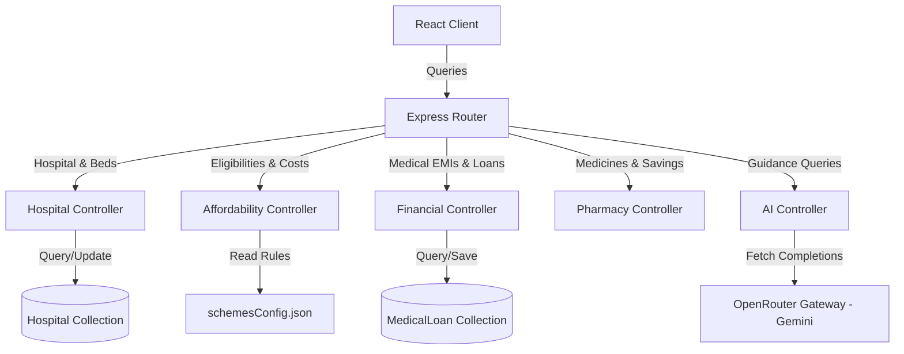

# Project Documentation – HealthBridge Access & Hospital Management Platform

HealthBridge is a full-stack, AI-powered healthcare access and management platform designed to optimize patient triaging, treatment price matching, insurance network approvals, and clinical scheduling.

---

## 1. Directory Structure & Modular Layout

The project is split into two modular codebases:
- **`Backend/`**: Node.js Express API server with MongoDB schemas and independent controller packages.
- **`Frontend/`**: React Vite application styled using TailwindCSS, housing unified patient dashboards, clinician screens, and the Affordability Hub.

```
Hospital-Appointment/
├── Backend/
│   ├── config/
│   │   └── schemesConfig.json  # Government scheme rules config
│   ├── Controllers/
│   │   ├── affordabilityController.js # Insurance & PM-JAY checks
│   │   ├── financialController.js     # Loans & EMI calculations
│   │   ├── hospitalController.js      # Bed counts & recommendations
│   │   ├── pharmacyController.js      # Brand-to-generic drug pricing
│   │   └── aiController.js            # Scribes and conversational AI guides
│   ├── models/
│   │   ├── HospitalSchema.js          # Hospital records, costs, and beds
│   │   └── MedicalLoanSchema.js       # EMI and loan applications
│   ├── Routes/
│   │   ├── affordability.js
│   │   ├── financial.js
│   │   ├── hospital.js
│   │   └── pharmacy.js
│   ├── utils/
│   │   └── seeder.js                  # Automatic mock data seeder
│   └── index.js
├── Frontend/
│   ├── src/
│   │   ├── components/
│   │   │   └── ChatAssistant/
│   │   ├── Dashboard/
│   │   ├── pages/
│   │   │   ├── Affordability/
│   │   │   │   ├── AffordabilityHub.jsx # Hospital comparison & pharmacy
│   │   │   │   └── HealthBridgeAI.jsx   # 4 AI Counselling Guides
│   │   │   │   ...
│   └── package.json
└── README.md
```

---

## 2. Expanded Database Schemas

We introduce two new collections to Mongoose:

### A. Hospital Schema (`HospitalSchema.js`)
Tracks locations, quality scores, waiting lists, specialty treatments, and real-time bed inventories:
- `name` (String, required, unique)
- `location` (String)
- `distance` (Number, in km)
- `rating` (Number)
- `waitingTime` (Number, in minutes)
- `specialties` (Array of Strings)
- `supportedInsurances` (Array of Strings)
- `beds` (Object):
  - `icu` / `general` / `private` / `emergency`: `{ total: Number, available: Number }`
- `treatmentCosts`: Array of `{ treatmentName: String, cost: Number }`

### B. Medical Loan Schema (`MedicalLoanSchema.js`)
Tracks patient loan financing applications:
- `user` (ObjectId, ref: `User`, required)
- `hospital` (ObjectId, ref: `Hospital`, required)
- `treatmentName` (String, required)
- `requestedAmount` (Number, required)
- `tenureMonths` (Number, required)
- `monthlyEMI` (Number, required)
- `status` (String, enum: `["pending", "approved", "rejected"]`, default: `"pending"`)
- `documents` (Array of Strings for file placeholders)

---

## 3. Rules-Driven Configurations

To avoid hardcoded validation rules, government healthcare plans (such as Ayushman Bharat / PM-JAY) are configured via **`Backend/config/schemesConfig.json`**:
```json
{
  "schemes": [
    {
      "id": "pmjay",
      "name": "Ayushman Bharat (PM-JAY)",
      "incomeThreshold": 250000,
      "familySizeLimit": 8,
      "requiredDocuments": ["Aadhaar Card", "Ration Card (BPL)", "Income Certificate"],
      "coveredTreatments": ["Cardiology", "Neurology", "Orthopedics", "Oncology", "General Surgery"],
      "maxCoverage": 500000
    }
  ]
}
```
The `affordabilityController` reads this file on every validation request to evaluate eligibility rules, covered treatments, and coverage caps dynamically.

---

## 4. API Endpoint Index

### A. Hospitals & Resources (`/hospitals`)
- `GET /hospitals/` - Retrieve all hospital options for comparison.
- `GET /hospitals/beds` - Get live ICU/general/private/emergency bed levels.
- `GET /hospitals/recommendations` - Smart recommendations for hospitals & doctors based on budget, distance, insurance, and specialty.

### B. Access & Affordability (`/affordability`)
- `GET /affordability/insurances` - Query supported insurance lists.
- `POST /affordability/eligibility` - Check PM-JAY and state scheme eligibility.
- `POST /affordability/coverage-estimator` - Estimate out-of-pocket patient payment rates after co-insurance.

### C. Financial Assistance (`/financial`)
- `GET /financial/estimate` - Calculate monthly EMI using standard interest math.
- `POST /financial/loan-request` - Submit a medical loan application (restricted to Patient role).
- `GET /financial/loans` - Retrieve loan request history.

### D. Pharmacy Alternatives (`/pharmacy`)
- `GET /pharmacy/medicines` - Compare brand prices to generic substitutes and compute savings margins.

### E. Expanded AI Copilots (`/ai`)
- `POST /ai/financial-counsel` - AI guide discussing loan EMIs, rates, and affordability.
- `POST /ai/insurance-guide` - Policy terminology interpreter.
- `POST /ai/cost-explainer` - Bill analyzer decomposing clinical charges.
- `POST /ai/hospital-recommend` - Recommendation assistant guiding referrals.

---

## 5. Architectural Flow


